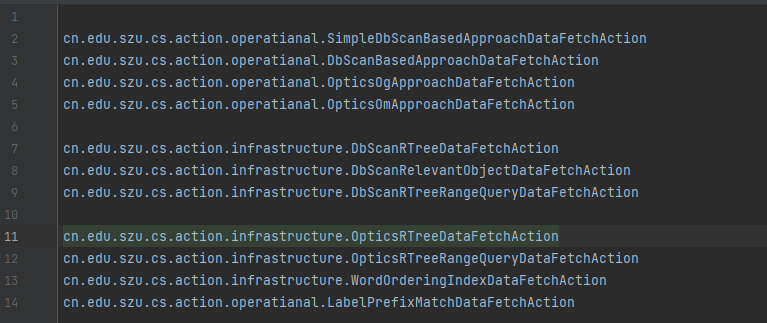

# 1 依赖导入

1. 将项目代码克隆下来，导入自己的项目当中。
2. 在项目的pom.xml文件中添加如下依赖：
```xml
    <groupId>cn.edu.szu.cs</groupId>
    <artifactId>k-stc</artifactId>
    <version>1.0.0</version>
```

# 2 聚类算法的使用

## 2.1 参数构建

```java
        KstcQuery kstcQuery = KstcQuery.builder()
                .keywords(
                        Arrays.stream(keywords.split(";")).collect(Collectors.toList())
                )
                .coordinate(new double[]{lon, lat})
                .k(k)
                .epsilon(epsilon)
                .minPts(minPts)
                .maxDistance(maxDist<=0?Double.MAX_VALUE:maxDist)
                .command(command)
                .build();
```
## 2.2 基于DBSCAN算法的使用

```java
        KstcQuery kstcQuery = KstcQuery.builder()
            .keywords(
            Arrays.stream(keywords.split(";")).collect(Collectors.toList())
            )
            .coordinate(new double[]{lon, lat})
            .k(k)
            .epsilon(epsilon)
            .minPts(minPts)
            .maxDistance(maxDist<=0?Double.MAX_VALUE:maxDist)
            .command("SIMPLE_DBSCAN_BASED_APPROACH")
            .build();

        DataFetchResult task = KstcDataFetchManager.generateTaskAndGet(
                DataFetchConstant.OPERATIONAL_LAYER,
                query.getCommand(), JSON.toJSONString(query));

        if (!task.isSuccess()) {
            throw new RuntimeException("Task failed: " + task.getMsg());
        }
        List<Set<RelevantObject>> result = (List<Set<RelevantObject>>) task.getData();
```


## 2.3 基于OPTICS算法的使用
```java
        KstcQuery kstcQuery = KstcQuery.builder()
            .keywords(
            Arrays.stream(keywords.split(";")).collect(Collectors.toList())
            )
            .coordinate(new double[]{lon, lat})
            .k(k)
            .epsilon(epsilon)
            .minPts(minPts)
            .maxDistance(maxDist<=0?Double.MAX_VALUE:maxDist)
            .command("OPTICS_BASED_APPROACH_OM")
            .build();

        DataFetchResult task = KstcDataFetchManager.generateTaskAndGet(
                DataFetchConstant.OPERATIONAL_LAYER,
                query.getCommand(), JSON.toJSONString(query));

        if (!task.isSuccess()) {
            throw new RuntimeException("Task failed: " + task.getMsg());
        }
        List<Set<RelevantObject>> result = (List<Set<RelevantObject>>) task.getData();
```


# 3 算法模块的扩展
## 3.1 数据集

DBSCAN算法的数据集
```java
            File objFile = new ClassPathResource("objs.zip").getFile();
            ZipFile objZipFile = new ZipFile(objFile);
            InputStream stream = objZipFile.getInputStream(objZipFile.entries().nextElement());
            dbscanDataLoader = new RelevantObjectDataLoaderImpl<>(stream, DefaultRelevantObject.class);

            KstcDataFetchManager.setDbscanDataLoader(dbscanDataLoader);
```

OPTICS算法的词序索引
```java
            File file = new ClassPathResource("wordOrderingIndex_10_100.zip").getFile();
            ZipFile zipFile = new ZipFile(file);
            InputStream inputStream = zipFile.getInputStream(zipFile.entries().nextElement());
            wordOrderingIndex = new WordOrderingIndex(inputStream);
        
            KstcDataFetchManager.setWordOrderingIndex(wordOrderingIndex);
```

## 3.2 DataAction

实现接口DataFetchAction，实现自定义的数据获取操作。
```java
public interface DataFetchAction <P extends BaseDataFetchActionParams,R>{

    String getCommand();

    String getCommandType();

    P parseParams(String paramsStr);

    boolean checkParams(P params);

    R fetchData(P params);

}

```

将实现类的全限定类目写到 resources/META-INF/cn.edu.szu.cs.action.DataFetchAction 文件中




## 3.3 DataFetchManager

实现接口DataFetchManager，实现自定义的数据获取管理器,将实现类设置到KstcDataFetchManager中。

```java
KstcDataFetchManager.setDataFetchManager(new DataFetchManager() {
    @Override
    public DataFetchResult generateTaskAndGet(String layer, String command, String params) {
        return null;
    }

    @Override
    public DataFetchResult getTaskResult(String taskId) {
        return null;
    }
});
```
